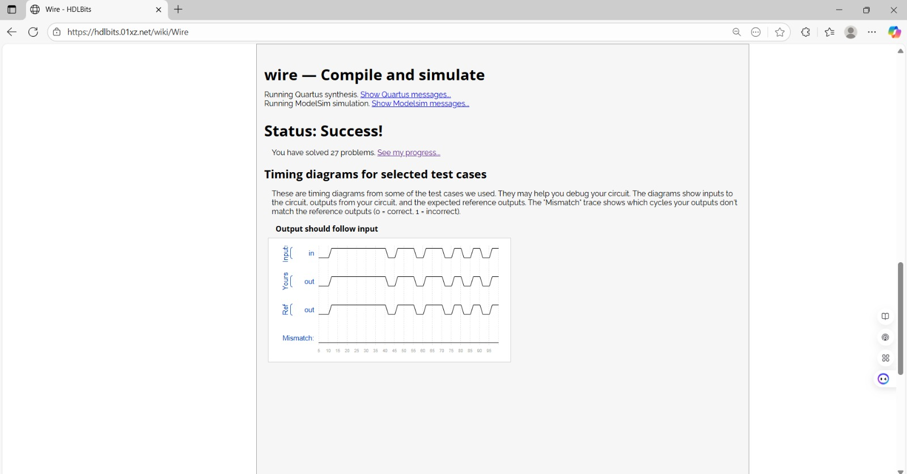
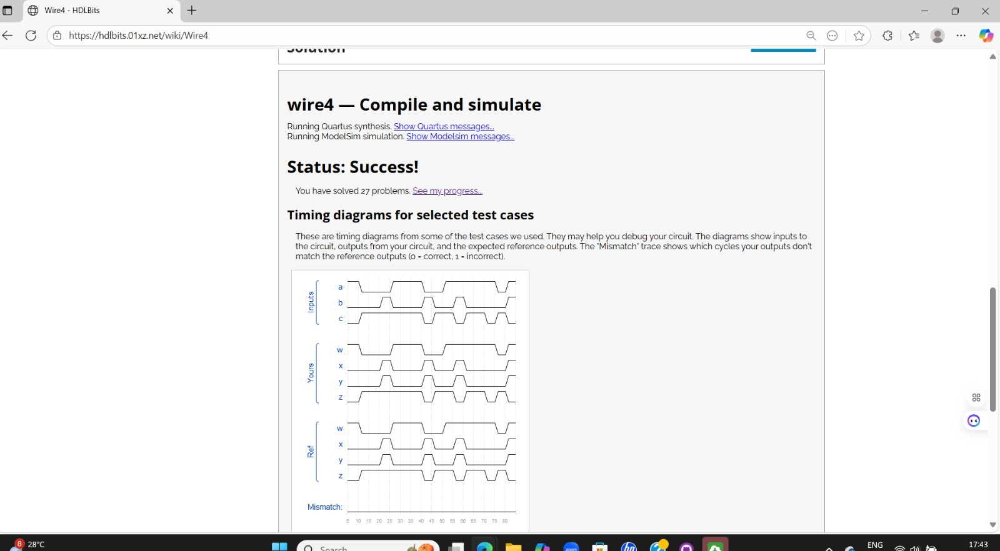

## DAY 2 – Basic Verilog Modules

This document contains image references and descriptions for Verilog simulations and circuit diagrams developed on Day 2.

## step1

**Description:**  
This Verilog module demonstrates a simple logic implementation combining basic gates to verify the initial design setup.  

## zero

**Description:**

This module (`zero.v`) tests the behavior of logic circuits with zero or ground input conditions, verifying the expected low output response.

## wire

**Description:**  

The `wire.v` module illustrates the use of wire connections in Verilog to transfer signals between components. It helps understand how continuous assignments work.  

## wire4

**Description:**  

The `wire4.v` code expands upon the `wire` concept to handle multi-bit signal connections. It demonstrates how multiple wire inputs can be grouped or manipulated together.  

